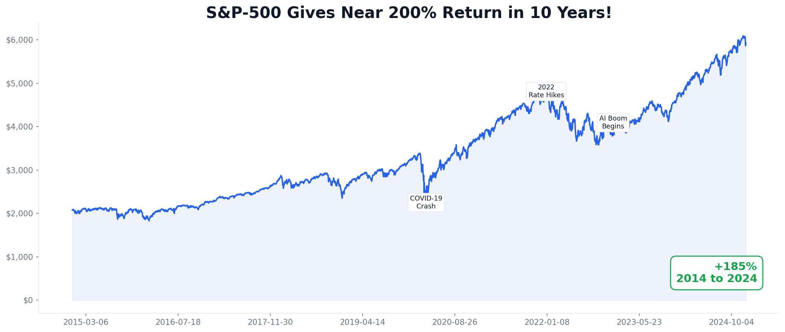
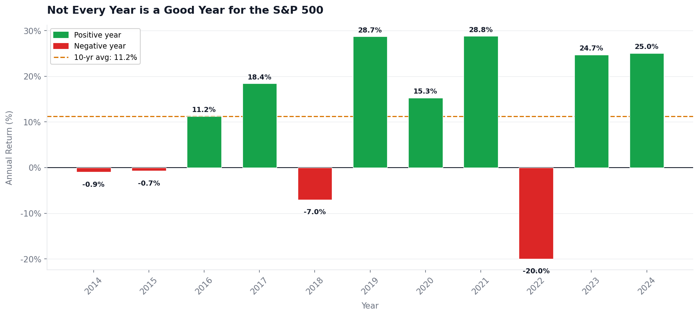
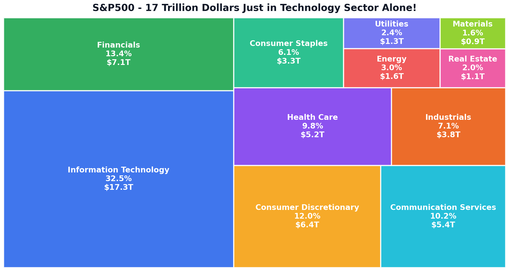
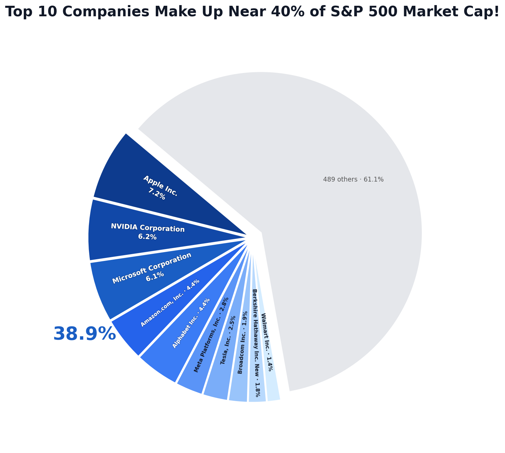
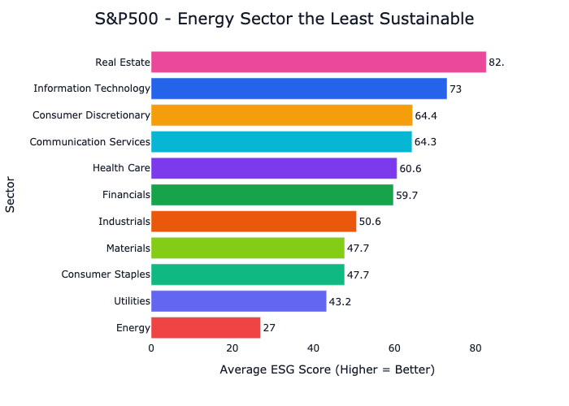
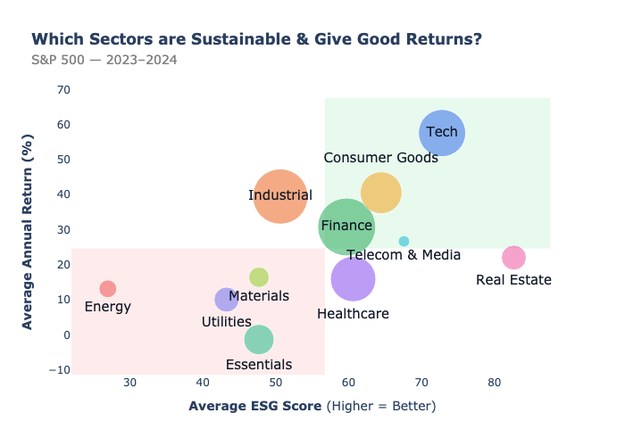
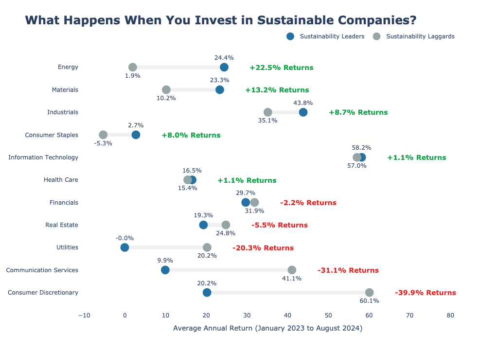
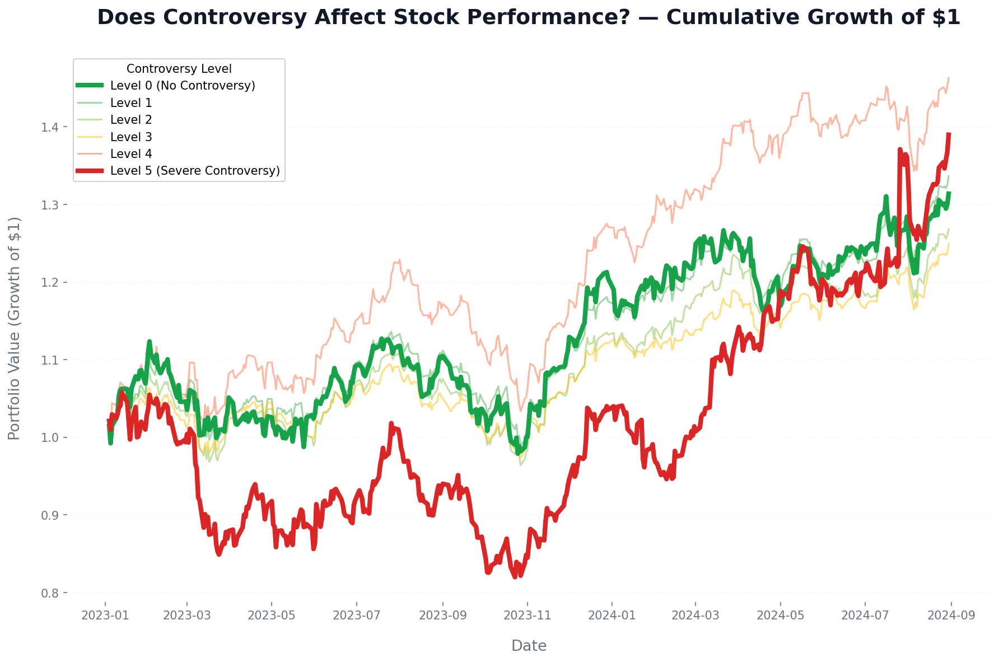
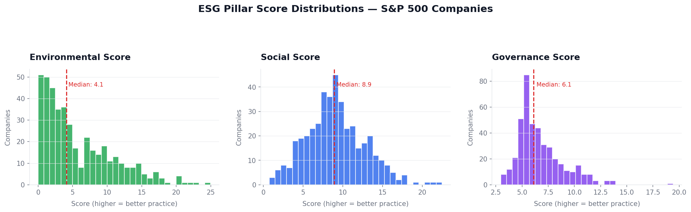
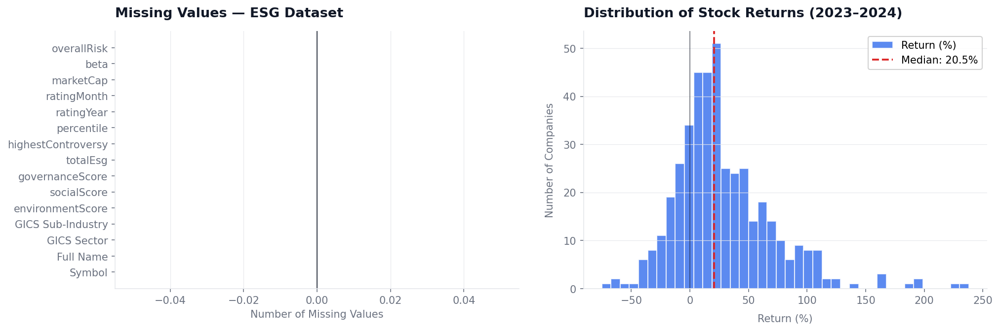

# S&P 500 & ESG Analysis — Financial Performance and Sustainability (2023–2024)

A data visualization project exploring market trends, sector composition, and the relationship between ESG scores and financial returns across S&P 500 companies.

---

## Overview

The S&P 500 is the most watched stock index in the world — 500 of the largest U.S. companies, representing roughly 80% of the American equity market. But beyond returns, there's a question that's become increasingly relevant to both institutional and retail investors: **does being a more sustainable company actually pay off?**

This project digs into that question using two datasets covering market fundamentals and ESG (Environmental, Social, Governance) ratings. The analysis spans a decade of index history, a breakdown of sector-level sustainability, and a direct comparison between ESG leaders and laggards within each sector.

Every chart in this project is built with a specific story in mind — no decoration for its own sake, no chartjunk. Just clean visuals with titles that say something.

---

## Research Questions

1. How has the S&P 500 evolved over the past decade, and what events shaped its trajectory?
2. Which sectors are the most and least sustainable by ESG score?
3. Is there a relationship between ESG performance and financial return?
4. Does corporate controversy level affect long-term stock performance?

---

## Who This Is For

- Investors curious about ESG and whether it actually matters financially
- Financial researchers looking at sector-level sustainability patterns
- Anyone wanting to understand the S&P 500 better — no advanced finance background needed

**Knowledge required:** Basic statistics and data visualization literacy. That's it.

---

## Datasets

| Dataset                      | Source                                                                                       | Coverage                                                                                |
| ---------------------------- | -------------------------------------------------------------------------------------------- | --------------------------------------------------------------------------------------- |
| S&P 500 Stocks               | [S&P 500 Stocks — Kaggle](https://www.kaggle.com/datasets/andrewmvd/sp-500-stocks)           | 502 companies, 14-year daily price history, key financial metrics, sector/industry tags |
| S&P 500 ESG & Stocks 2023–24 | [S&P 500 ESG and Stocks Data 2023–2024 — Kaggle](https://www.kaggle.com/datasets/rikinzala/) | ESG pillar scores, controversy ratings, stock returns for 2023–2024                     |

The ESG `totalEsg` score from Yahoo Finance uses an inverted scale by default (lower = better). This project **re-scales and inverts it to 0–100**, where higher always means better sustainability — because that's the direction that makes sense to a reader.

---

## Visualizations

All graphs are saved to the `graphs/` folder. Here's what each one shows:

### S&P 500 Index — 10-Year Growth


A line chart of the S&P 500 from 2014 to 2024, annotated with the three key macro events that shaped the decade: the COVID-19 crash, the 2022 rate hike cycle, and the AI-driven bull run. The index delivered +185% over the period.

---

### Annual Returns — Year by Year


A bar chart breaking down calendar-year returns, coloured green for positive and red for negative. Out of 10 full years, 8 were positive. The average sits at 11.2%. This chart makes it obvious why timing the market is harder than it sounds.

---

### Sector Market Cap — Treemap


A treemap showing how total market capitalisation is distributed across sectors. Information Technology alone accounts for 32.5% — $17.3 trillion. This composition matters for ESG analysis because tech companies are inherently less carbon-intensive than energy or industrial firms, which biases aggregate ESG scores.

---

### Top 10 Market Cap Concentration


A pie chart showing that just 10 companies — Apple, NVIDIA, Microsoft, Amazon, and others — make up nearly 39% of the entire index. Any index-level return or ESG figure is heavily shaped by these names.

---

### ESG Scores by Sector


A horizontal bar chart ranking sectors by average ESG score. Real Estate and Information Technology score highest. Energy sits at the bottom with a score of 27 — less than half the sector average. This largely reflects the structural carbon intensity of fossil fuel extraction rather than individual company behaviour.

---

### ESG Score vs. Financial Return — Sector Scatter


A bubble chart plotting each sector's average ESG score against its average annual return, with bubble size proportional to the number of companies. The green shaded quadrant (top-right) marks above-average ESG and above-average returns. Tech and Finance land there. Energy and Utilities do not. The relationship isn't perfectly linear — it's partly a proxy for how modern the sector is.

---

### Sustainability Leaders vs. Laggards Within Each Sector


The most analytically rigorous chart in the project. Within each sector, companies are split into the top half (Leaders) and bottom half (Laggards) by ESG score, and their average returns are compared. This controls for sector membership. Results are mixed — in Energy and Materials, leaders clearly outperform; in Consumer Discretionary and Communication Services, they don't. The ESG premium is real in some sectors and absent in others.

---

### Controversy Level vs. Cumulative Portfolio Growth


A time-series chart tracking the cumulative growth of $1 invested in portfolios grouped by controversy level (0 = no controversies, 5 = severe). Level 0 companies grow more smoothly with less volatility. Level 5 companies show significant drawdowns, particularly in 2023. The clearest takeaway in the whole project: serious controversies have a measurable financial cost.

---

### ESG Pillar Score Distributions


Three histograms showing the distribution of Environmental, Social, and Governance scores separately across all S&P 500 companies. Environmental scores are the most dispersed — some companies are genuinely doing very little. Governance scores cluster high, suggesting broad adoption of basic board practices. Social sits in between.

---

### Data Quality — Missing Values & Return Distribution


A two-panel diagnostic chart. Left: no missing values across any column in the ESG dataset. Right: the return distribution is right-skewed with a median of ~20.5%, consistent with the strong bull market conditions of 2023–2024.

---

## Tech Stack

```
Python 3.10+
├── pandas          — data manipulation and merging
├── numpy           — numerical operations
├── plotly          — interactive charts (scatter, bar, dumbbell)
├── matplotlib      — static charts (bar, line, histogram, pie)
├── seaborn         — style and despine utilities
├── squarify        — treemap layout
└── kaleido==0.2.1  — static image export from Plotly
```

---

## Getting Started

### 1. Clone the repository

```bash
git clone https://github.com/Jatin-Khiyani/financial-data-visualization.git
cd financial-data-visualization
```

### 2. Create and activate a virtual environment

```bash
python -m venv env
```

**macOS / Linux:**

```bash
source env/bin/activate
```

**Windows:**

```bash
env\Scripts\activate
```

### 3. Install dependencies

```bash
pip install -r requirements.txt
```

> **Note:** The `kaleido` version is pinned to `0.2.1` in `requirements.txt`. Kaleido `1.x` breaks Plotly's `write_image` — do not upgrade it.

### 4. Add the datasets

Download both datasets from Kaggle and place them as follows:

```
project/
├── Dataset1/
│   ├── sp500_companies.csv
│   ├── sp500_index.csv
│   └── sp500_stocks.csv
└── Dataset2/
    ├── sp500_esg_data.csv
    ├── processed_esg_returns.csv
    └── sp500_price_data.csv
```

### 5. Open the notebook and select the kernel

```bash
jupyter notebook
```

In Jupyter, open `Final_Project_Improved.ipynb`. Go to **Kernel → Change Kernel** and select the `env` environment you created.

### 6. Run all cells

Go to **Cell → Run All** or use `Shift + Enter` through each cell sequentially.

All graphs will be saved automatically to the `graphs/` folder.

---

## Project Structure

```
project/
├── Dataset1/                    # S&P 500 price and company data
├── Dataset2/                    # ESG scores and return data
├── graphs/                      # All saved chart outputs
├── Final_Project_Improved.ipynb # Main analysis notebook
├── requirements.txt
└── README.md
```

---

## Key Findings

- The S&P 500 returned +185% over 2014–2024, with positive returns in 8 of 10 years
- Technology dominates the index at 32.5% of total market cap — this structurally inflates its ESG ranking
- Energy is the least sustainable sector by a wide margin (ESG score: 27 vs. sector average ~58)
- The ESG–return relationship is not linear at the sector level; it partly reflects how capital-light or modern a sector is
- Within sectors, the ESG premium is inconsistent — strong in Energy and Materials, absent in Consumer Discretionary
- **The clearest finding:** companies with severe controversies (Level 5) show measurably worse long-term portfolio growth and higher volatility compared to controversy-free companies

---

## Notes

This project was built as part of a Data Visualization course. The analysis period (2023–2024) falls within a strong bull market, which means returns are elevated across the board and isolating an ESG-specific effect is harder than it would be in a downturn or bear market. Findings should be interpreted with that context in mind.
